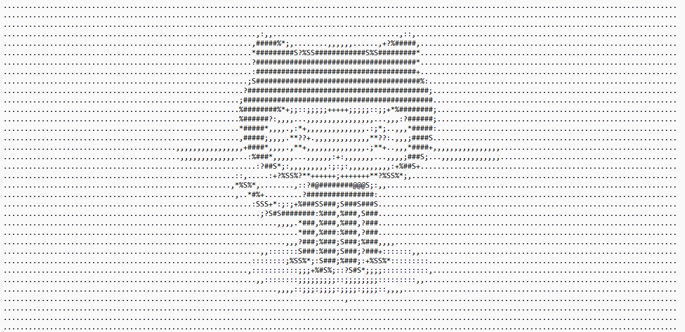

# AsciiArt

Hey! In this simple project, I wrote a python program that takes an image as input, and recreates the same image using Ascii Characters instead of colors and pixels! If you are confused, looking at some photos might help

For example, this GitHub logo...

...becomes...

    

Hope you enjoy playing with this on your own, trying to give the program your own favorite photos! Have fun!
